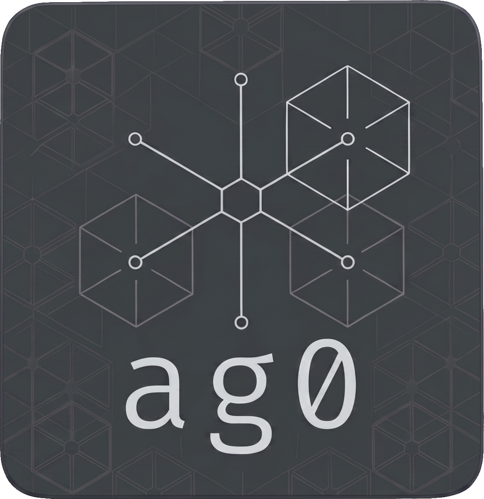
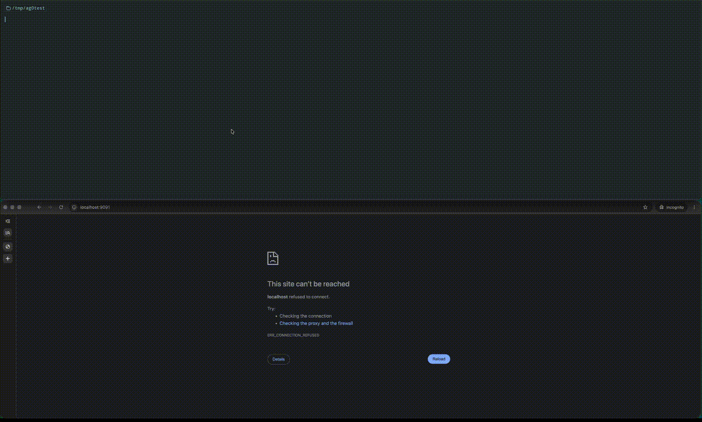

# ag0
<p align="center">
  
</p>

<p align="center">
  <strong>Self-hosted multi-agent AI harness in Go.</strong>
</p>

<p align="center">
  
</p>

ag0 is a small, opinionated orchestration service: a single coordinator routes
each user message to one or more specialist sub-agents, each with its own
model, system prompt and MCP tool whitelist. When multiple agents reply, the
coordinator synthesizes them into one answer. When one replies, it's returned
verbatim. The whole thing is a single Go binary with the chat UI embedded —
deploy it on a Raspberry Pi, a laptop, or in a container. No SaaS, no
dashboard, no plugins to install.

## Quick start

```bash
git clone https://github.com/kyzrfranz/ag0
cd ag0

# Bootstrap from the committed templates
cp agents.example.yaml      agents.yaml
cp coordinator.example.yaml coordinator.yaml   # optional
cp context.example.md       context.md         # optional

# Build UI + binary
make binary

# Run
export ANTHROPIC_API_KEY=sk-ant-...
export GOOGLE_API_KEY=...                  # only if any agent uses gemini-*
export MCP_URL=http://localhost:8765/mcp   # optional
./dist/ag0
```

Open `http://localhost:9090` for the embedded chat UI, or talk to the API
directly:

```bash
curl -i -X POST http://localhost:9090/chat \
  -H 'Content-Type: application/json' \
  -d '{"message":"hello"}'
```

The response carries an `X-Session-Id` header — send it back on the next
request to continue the same conversation.

## Architecture

```
                          ┌──────────────────────┐
   user message    ──►    │   coordinator (LLM)  │
   + history             │   - routes (haiku)   │
                          │   - synthesizes      │
                          └──────┬──────┬────────┘
                                 │      │
                  fan-out ───────┘      └─────── fan-out
                  ▼                                 ▼
        ┌────────────────────┐            ┌────────────────────┐
        │  agent: researcher │            │  agent: writer     │
        │  model: claude-... │   ...      │  model: gemini-... │
        │  tools: [a,b,c]    │            │  tools: []         │
        └─────────┬──────────┘            └─────────┬──────────┘
                  │  MCP                            │  MCP
                  ▼                                 ▼
        ┌──────────────────────────────────────────────────────┐
        │              MCP server(s) over HTTP                  │
        └──────────────────────────────────────────────────────┘
```

- **Routing** is a single cheap LLM call (Haiku by default) that picks which
  agents respond to each turn.
- **Each agent runs concurrently** with native tool calling — the model
  decides which MCP tools to invoke and fills args directly from MCP schemas.
- **Single-agent shortcut**: when only one agent replies, its output is
  returned without a synthesis pass.
- **Provider routing**: agents with `model: gemini-*` use the Gemini client;
  everything else uses the Anthropic client.

## Configuration

ag0 reads three config files from the working directory. The repo ships
`.example` templates and gitignores the real files so personal prompts,
tool whitelists and context never leak upstream.

| File              | Required | Env override            | Default            | Missing behavior |
| ----------------- | -------- | ----------------------- | ------------------ | ---------------- |
| `agents.yaml`     | **yes**  | `AGENTS_CONFIG`         | `agents.yaml`      | Exits with hint to copy from `agents.example.yaml` |
| `coordinator.yaml`| no       | `COORDINATOR_CONFIG`    | `coordinator.yaml` | Built-in defaults (Sonnet synthesis, Haiku routing) |
| `context.md`      | no       | `USER_CONTEXT`          | `context.md`       | Loaded into no agent — runs without static context |

See [`agents.example.yaml`](agents.example.yaml),
[`coordinator.example.yaml`](coordinator.example.yaml), and
[`context.example.md`](context.example.md) for annotated starting points.

### `agents.yaml`

A top-level list of agents. Each entry:

| Field          | Notes                                                         |
| -------------- | ------------------------------------------------------------- |
| `name`         | Unique id; used by the router LLM to pick agents              |
| `description`  | Shown to the router so it knows when to pick this agent       |
| `model`        | Any Claude or Gemini model id                                 |
| `system_prompt`| The agent's persona / instructions                            |
| `mcp_tools`    | List of tool names. **Empty `[]`** → discovery mode (all tools available) |
| `truncate_from_end` | Flip tool-result truncation. Default keeps newest data at the end; set `true` for responses where the start matters more |

### `coordinator.yaml`

| Field           | Notes                                                          |
| --------------- | -------------------------------------------------------------- |
| `model`         | Synthesis model (used when multiple agents reply)              |
| `router_model`  | Selection model (use a cheap one — Haiku by default)           |
| `system_prompt` | Guides how multi-agent replies are merged                      |

All three fields are optional; missing ones fall back to defaults. A
missing `coordinator.yaml` entirely is also fine.

### `context.md`

Plain markdown. Whatever you put here is appended to **every** agent's
system prompt (and the coordinator's), prefixed with `## User Context`.
Use it for static, slowly-changing context — your role, preferences,
ongoing projects — that every agent should know.

## Environment variables

| Variable             | Purpose                                                  | Default            |
| -------------------- | -------------------------------------------------------- | ------------------ |
| `PORT`               | HTTP port                                                | `9090`             |
| `ANTHROPIC_API_KEY`  | Claude API key                                           | —                  |
| `GOOGLE_API_KEY`     | Gemini API key (only needed if you use `gemini-*` agents)| —                  |
| `MCP_URL`            | MCP server URL; omit to run without MCP tools            | —                  |
| `MONGODB_URI`        | Profile store; omit → in-memory                          | —                  |
| `AGENTS_CONFIG`      | Path to agents YAML                                      | `agents.yaml`      |
| `COORDINATOR_CONFIG` | Path to coordinator YAML                                 | `coordinator.yaml` |
| `USER_CONTEXT`       | Path to static context markdown                          | `context.md`       |
| `MAX_HISTORY_MESSAGES` | Per-session history cap                                | `20`               |
| `MAX_TOOL_RESULT_CHARS` | Truncation threshold for MCP tool results            | `8000`             |
| `DEFAULT_SESSION_ID` | Shared session id for clients that don't send the header | random UUID        |
| `CORS_ORIGIN`        | `Access-Control-Allow-Origin` value                      | `*`                |
| `LOG_LEVEL`          | `debug` \| `info` \| `warn` \| `error`                   | `info`             |

## Build

The repo ships a `Makefile` with the common targets:

```bash
make binary       # builds UI then native binary into ./dist/ag0
make mac          # macOS arm64 + amd64
make linux        # linux amd64 + arm64
make windows      # windows amd64
make all          # all of the above
make docker       # multi-stage Docker build (UI + Go), tagged via DOCKER_TAG
make docker-push  # build + push
make clean        # remove ./dist and ui/dist
```

The UI build (`cd ui && npm install && npm run build`) runs first and its
`dist/` output is embedded into the Go binary via `//go:embed`, so a single
binary serves both the API and the chat UI from one port.

### Docker

The image bakes in only the `.example.*` templates; mount your real configs
at runtime:

```bash
docker build -t ag0 .
docker run --rm -p 9090:9090 \
  -e ANTHROPIC_API_KEY=$ANTHROPIC_API_KEY \
  -v $(pwd)/agents.yaml:/app/agents.yaml \
  -v $(pwd)/coordinator.yaml:/app/coordinator.yaml \
  -v $(pwd)/context.md:/app/context.md \
  ag0
```

## API

### `POST /chat`

```json
// request
{ "message": "..." }

// response
{ "response": "..." }
```

- Send `X-Session-Id: <uuid>` to continue a conversation. If omitted, the
  request joins the default session (logged at startup).
- The server always echoes the resolved `X-Session-Id` in the response
  header (exposed via CORS).

### `GET /ws/chat`

WebSocket endpoint that streams tokens and activity events (`agent`/`tool`
start/stop). Session id is taken from the `session_id` query parameter or
`X-Session-Id` header.

### `GET /history?session_id=<uuid>`

Returns the conversation history for a session as `{messages: [{role, content}, …]}`.
Unknown sessions return an empty array.

### `GET /health`

Returns `200 OK` with an empty body.

## Project structure

```
cmd/ag0/
  main.go                — HTTP server + WebSocket + session store + CORS

internal/
  orchestrator/
    coordinator.go        — selectAgents, fan-out, synthesize, streaming
    coordinator_config.go — coordinator.yaml loader
    agents.go             — Agent type, Invoke, native tool calling
    config.go             — agents.yaml loader

  memory/
    profile.go            — Store interface, InMemory + Mongo stub
    context.go            — AgentContext + Builder

  llm/
    llm.go                — Client interface, shared types
    anthropic.go          — Claude API client + prompt caching
    gemini.go             — Gemini API client + implicit caching

  mcp/
    client.go             — MCP client via github.com/modelcontextprotocol/go-sdk

ui/
  embed.go                — //go:embed all:dist
  src/                    — Vue 3 + Pinia chat UI
  dist/                   — Vite build output (gitignored, embedded at compile)
```

## License

ag0 is licensed under the [Business Source License 1.1](LICENSE) (BSL 1.1).

- **Personal and non-commercial use is permitted** under the Additional
  Use Grant in the LICENSE file.
- **Commercial use requires a license** — contact
  [thomas.hieber@gmail.com](mailto:thomas.hieber@gmail.com) for terms.
- **The license converts to Apache License 2.0 on 2030-05-19** (or the
  fourth anniversary of the first publicly available distribution of a
  given version under this License, whichever comes first).

See [`LICENSE`](LICENSE) for the complete, authoritative terms — the bullet
list above is a summary, not a substitute.